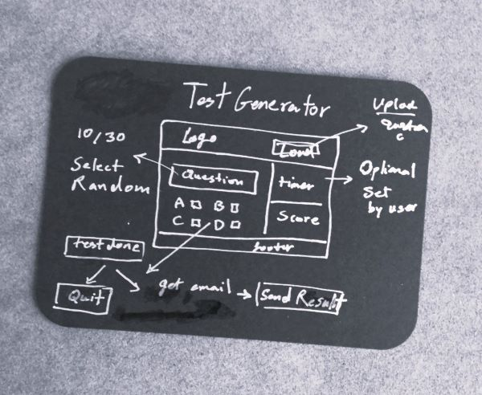

# Project Idea
## Test Generator

## Requirements
* Upload Test Questions
* Generate 10 Random Question
* Option to set the timer
* Option to quit/reset
* Process and score the questioner 
* Option to email the result 
 

## JavaScript / Interactive web page
## Commit rules
* Add = Create a capability 
* Cut = Remove a capability 
* Fix = Fix 
* TST= Test 
* Opt = Refactor of performance
* Doc = Refactor of documentation

### Notes for documentation
* using GRID Layout to maintain responsivity