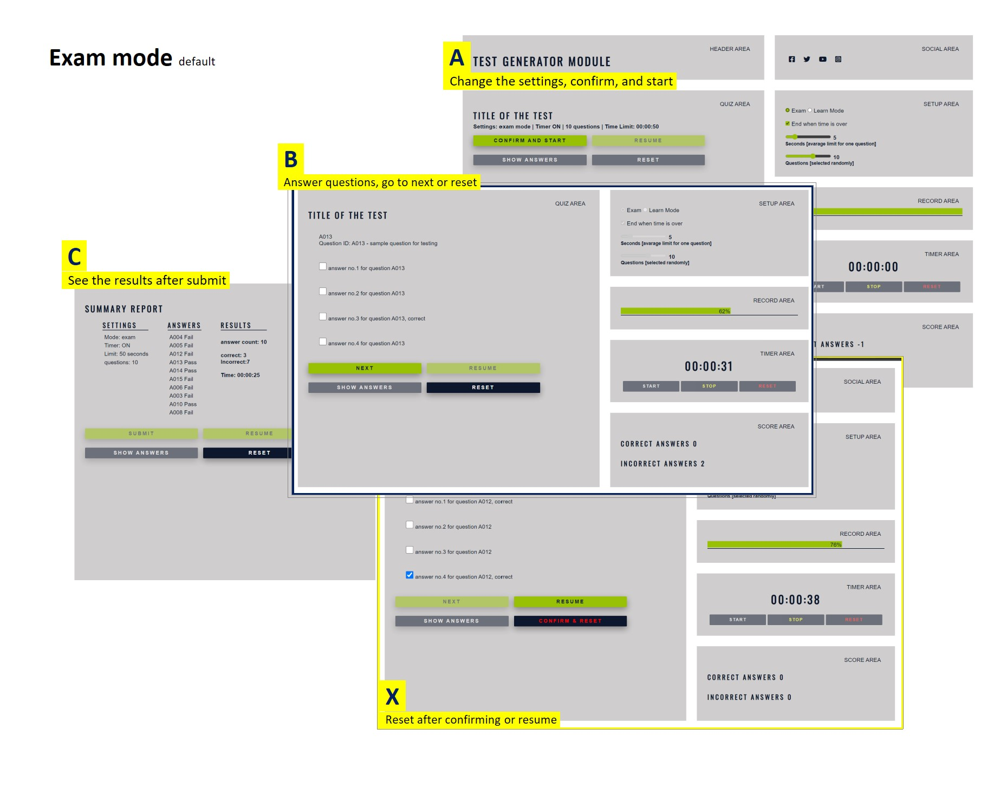
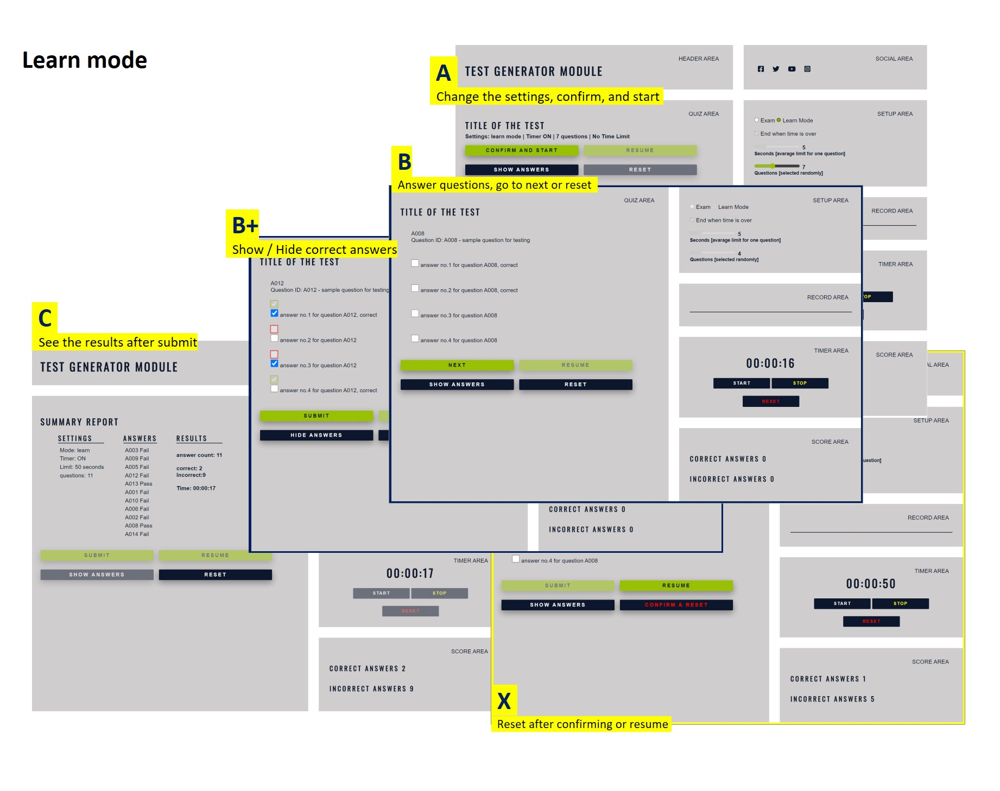
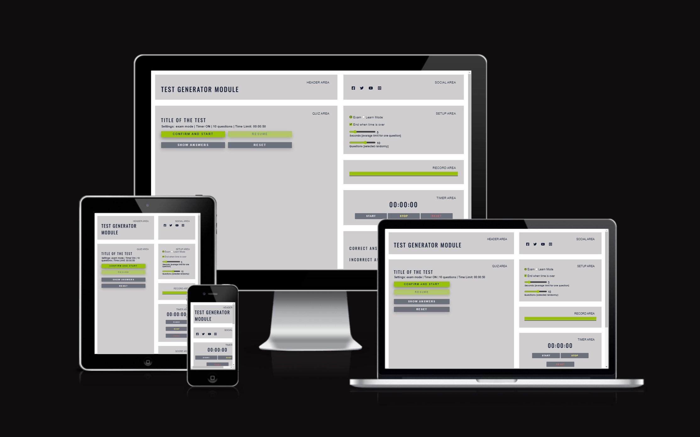
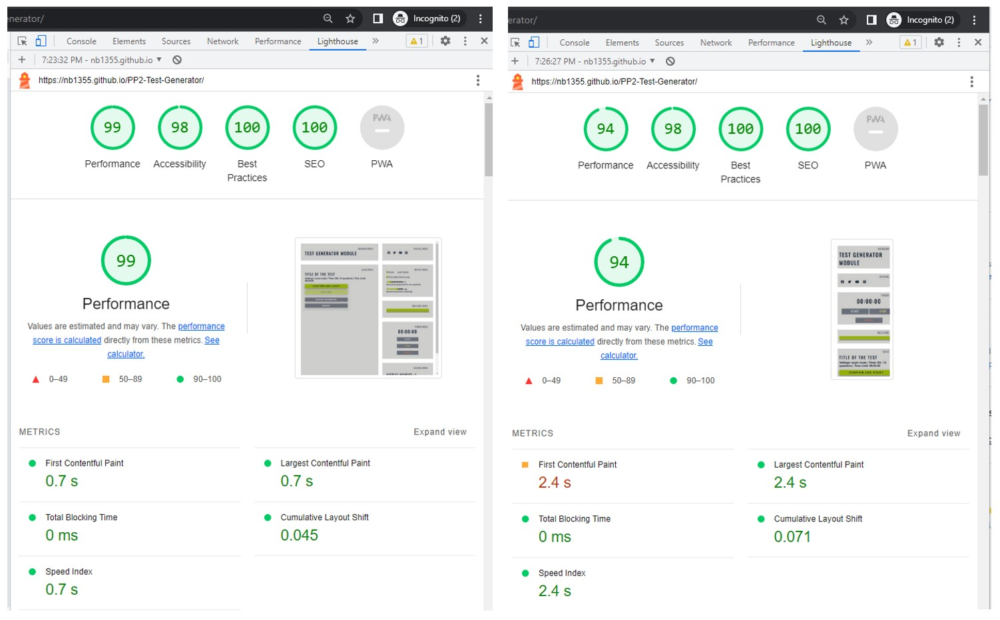
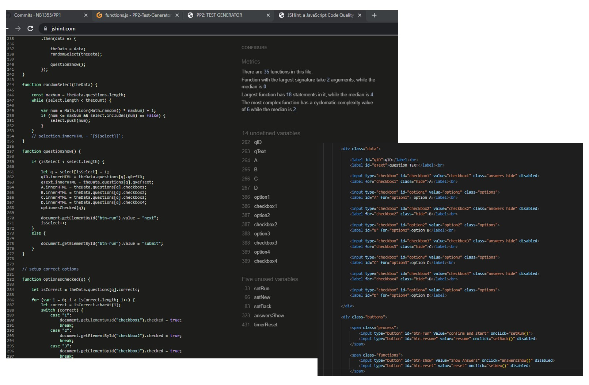
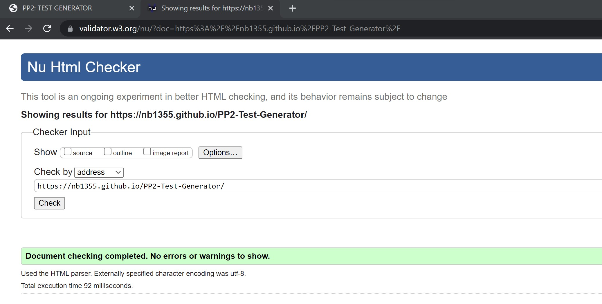
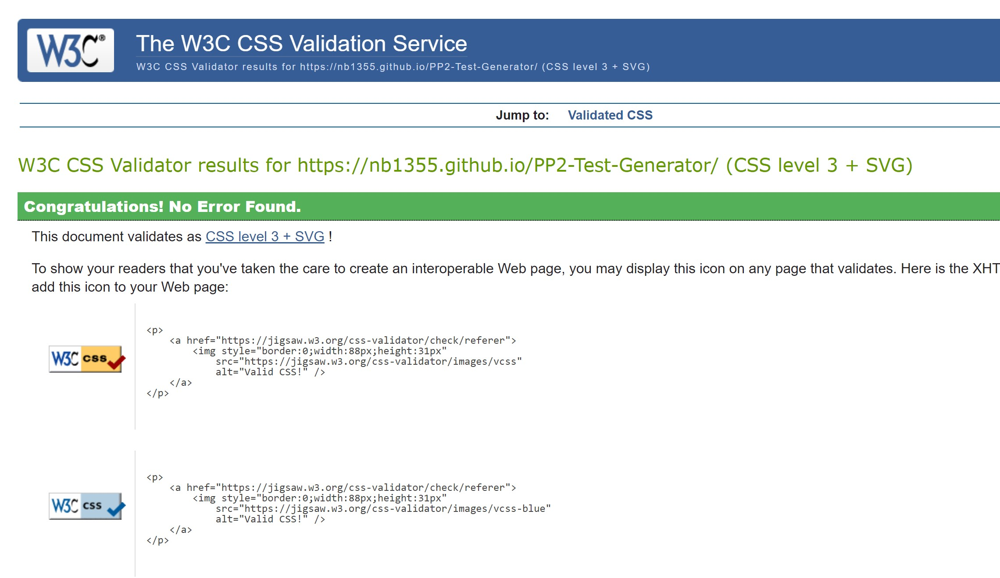

### PPII: JavaScript / Interactive web page
# Test Generator

#### This website is developing parallel to forming a new business idea to offer an online service to generate questionares, process the answers, and report the results. Filling out the questionnaire with no time limit and the possibility of seeing the correct answers should be available to support user preparing for tests.   
 

|**FEATURES**|IDEA|
|:-----------|:---|
|    1. Upload datasets **   2. Choose from available dataset **    3. Generate a set of questions randomly     4. Auto/ Manual Timer     5. Option to see correct answers   6. Calculate the +- score   7. Show results after submitting      8. Email the results on demand   9. Reset after confirmation or resume   10. Exam and Lean Mode      ||
|| ** Out of Scope:  **Will be considerde as a separate module bundel with user accounts.**        The Upload datasets by the user need a proper validation process, ideally stored in a database, and need to be separated from the process of generating and processing a questionnaire.  |
||

|**REQIREMENTS**  |     |  |  |  |
|-----------------------|----------------|-------------------------------|----|------------------------------------------|
|                       |***Exam***      |***Learn***                    | \|\|  |***Dataset:***  JASON                  |
|***Timer***            | countdown      | keep the time                 | \|\|  |***Questions:*** Multiple choice 2-4   | 
|***end in time***      | optional       | not available                 | \|\|  |***Answers:*** More then one possible  |               
|***manual timer***     | not available  | start, stop, reset            | \|\|  |***Content:*** Controlled, for visual validation |            
|***see the answers***  | not available  | hidden when loading questions | \|\|  |***Submit:*** Manual, after last question
|||||***User Experience:***   - Easy navigation Simple visuals  - Focus on functionality & validation   - comfortable with any device size  | 
|delivered all!|

 

# PRODUCT 
### One page meets the features and requirements ***in the scope***. 

| MODE    | MANUAL USER TESTS                       |
|:--------|:------------------------------------------------|
|**EXAM** |                                                 |   
|         |   |
|**LEARN**|                                                 |
|         |   |

  

# DEVELOPMENT

## Technology, Tools, Resources
 

* JavaScript | HTML | CSS | Dockerfile | JASON 

* GitHub:
	* GitPod to create and edit the project files.
	* Git to add, commit, and push the project files to GitHub.
	* GitHub Pages turns GitHub Repositories into Websites.
	* Using the GitPod Full Template from the Code Institute.
 
 
  
* Google Chrom Lighthouse
* [W3C CSS Validator](https://jigsaw.w3.org/css-validator/)
* [W3C Markup Validator](https://validator.w3.org/)
* [Resopnsive Design Test](https://ui.dev/amiresponsive)
* [js Validator](https://jshint.com//)

 

* Google fonts using Google fonts Ozwald and Lato in different  

 

* Extrea Readings
    - W3schools
    - CSS Tricks
    - Master CSS Grids
    - Stackoverflow
    - codepen

 

## Deployment
The project was deployed to GitHub Pages using the following steps:
* In the GitHub repository, navigate to the Settings tab.
* From the source section drop-down menu, select the Main Branch.
* Once the main branch has been selected, the page will be automatically refreshed with a detailed ribbon display to indicate the successful deployment.
* commits show the transfer from dev and resolving minor issues at the end

## Commit rules
* ADD = Create a capability 
* CUT = Remove a capability 
* FIX = Fix 
* TST= Test 
* OPT = Refactor of performance
* DOC = Refactor of documentation
  

# DEVELOPER TESTS
 

|**OVERVIEW OF TESTS AND FIXES**|||||| 
|------------|--------|---------|------------|-------------------|------------------------------------|
|Ref         |Status  |Commit   |Checkd      |Tool               |Note                                |    
| Dev-001-01 | F      | 3edbdb4 | code       | jshint            | 6 warn, 20 under., 5 unused        |
| Dev-001-02 | p-     | d13fb63 | code, live | jshint            | 0 warn, remaining html def's       |
| Dev-002-01 | p-     | 3edbdb4 | live       | Lighthouse Perf.  | 0 error, 1 warn, ::interest-cohort |
| Dev-003-01 | F      | 3edbdb4 | code       | W3C Html          | 21 error , 6 warn                  |
| Dev-003-02 | Pass   | 138c3e5 | code, live | W3C Html          | no issue, all solved               |
| Dev-004-01 | Pass   | 3edbdb4 | code, live | W3C CSS           | no issue found                     |
| Dev-005-01 | Pass   | 3edbdb4 | live       | ui.dev            | https://ui.dev/amiresponsive       |  
| Dev-006-01 | Pass   | 3edbdb4 | live       | Lighthouse Perf.  | 0 error, 1 warn, ::interest-cohort |

  

|  **DEVELOPER TEST SNAPSHOTS**                      |                                                       |
|----------------------------------------------------|-------------------------------------------------------|
| **Responsivity**                                   |**Performance** desktop & mobile                       |
|      |         |
|**javascript**                                      |                                                       |
|      |   unused and undefined cases ard calle from html   there is no issue with functioality |
| **html**                                           | **css**                                               |
|      |         |

  

# Open Topics

1. Indexing the readme file
2. Resolve the 'interest-cohort' warning in the Lighthouse performance report
3. Check if the js code needs to be changed

  

# Credits

* [Coding Beauty](https://codingbeautydev.com) for ideas on how to build the timer feature.
* [CodeExplainedRepo](https://github.com/CodeExplainedRepo/Multiple-Choice-Quiz-JavaScript/blob/master/quiz.js) refrence for js code to process the questionare.
* [JavaScript Tutorial](https://www.javascripttutorial.net/javascript-fetch-api/) refrence for reading from a JASON file. 

Special thanks to my mentor [Naoise Olof Seán Gaffney](https://github.com/NaoiseGaffney) for supporting me in designing and developing the concept; and *[Code Institute](https://learn.codeinstitute.net/dashboard) for providing the knowledg base and learning material.

